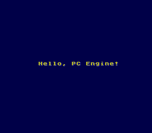

# PC Engine / TurboGrafx-16 Template

A minimal hello-world / project template for the **NEC PC Engine** (known as the **TurboGrafx-16** in North America), targeting the HuC6280 CPU and HuC6270 VDC. **Pure assembly**, built with PCEAS.

The template prints `Hello, PC Engine!` on screen and idles in a vsync loop. It exists to give you a working build/run/clean cycle and a project layout you can grow into a full game without restructuring.



The layout (`src/pce/{app,engine,system}/` tree, master Makefile with `build` / `run` / `load` targets, `.vscode/` task wrappers, `assets/` + `scripts/` for the asset pipeline) follows a three-tier separation between top-level entry, portable game systems, and hardware-facing HAL.

## Supported platforms

| Platform                    | CPU      | Assembler | Output                |
|-----------------------------|----------|-----------|-----------------------|
| PC Engine / TurboGrafx-16   | HuC6280  | `pceas`   | `build/pce/hello.pce` |

The HuC6280 is a 65C02 derivative with extra opcodes and a paged memory model. **It is not supported by `cc65`/`ca65`** — the PCE community standardised on PCEAS, the assembler shipped with the [HuC](https://github.com/pce-devel/huc) toolchain.

## Prerequisites

| Tool | Source | Purpose |
|------|--------|---------|
| [HuC](https://github.com/pce-devel/huc) | Build from source | Provides `pceas` (assembler), `pcxtool` (graphics conversion forward path) + `pce2png` (verify VDC output by re-rendering it), `mml` (music), and the **CORE(not TM)** library used as the system HAL |
| [Geargrafx](https://github.com/drhelius/Geargrafx) | GitHub releases | PCE / TG-16 / SuperGrafx / CD-ROM² emulator with a full debugger; auto-loads PCEAS `.sym` files for source-level debugging |
| [Aetherbyte Squirrel](https://aetherbyte.itch.io/squirrel) | itch.io | Audio engine for music + SFX (used at runtime, not in the build pipeline) |

### Locating HuC

The Makefile auto-detects the HuC install root from `pceas`'s location on `PATH`:

```sh
export PATH="$HOME/development/tools/huc/bin:$PATH"
```

If `pceas` isn't on `PATH`, override `HUC_HOME` directly:

```sh
make HUC_HOME=/path/to/huc build
```

`make check-tools` verifies both `pceas` and `geargrafx` are reachable and prints the resolved `HUC_HOME`.

### Geargrafx on Linux

Geargrafx ships as a portable ELF binary; grab the latest Linux build from the [Releases page](https://github.com/drhelius/Geargrafx/releases), unpack it, and add the directory to `PATH` so `geargrafx` is callable from anywhere. With the binary at `~/development/tools/geargrafx/geargrafx`, the relevant `~/.bashrc` snippet is:

```sh
if [ -d "$HOME/development/tools/geargrafx/" ]; then
    PATH="$HOME/development/tools/geargrafx:$PATH"
fi
```

The Makefile invokes `geargrafx build/pce/hello.pce build/pce/hello.sym`. Geargrafx auto-loads `<rom>.sym` when present, so symbol-aware debugging "just works" once the build drops the `.sym` next to the `.pce` (which it does — see the build outputs below). The emulator supports the **PCEAS symbol format** natively (both old and new variants).

## Building

```sh
make build         # PC Engine -> build/pce/hello.pce
make all           # alias for build
make check-tools   # verify pceas + geargrafx on PATH
make clean         # wipe build/ and release/
make help          # list every target
```

The build emits three files into `build/pce/`:

| File         | Purpose                                                 |
|--------------|---------------------------------------------------------|
| `hello.pce`  | The HuCard ROM. Load this in Geargrafx / a flash cart.  |
| `hello.sym`  | PCEAS symbol file in the format Geargrafx auto-loads (ASM source-level breakpoints + step). PCEAS emits this because the Makefile passes `-gA`. |
| `hello.lst`  | Full listing with macro expansions (`-m -l 2`).         |

## Running

There are two ways to launch the emulator, with different ergonomics:

```sh
make run    # build + auto-load the ROM
            #   -> geargrafx build/pce/hello.pce build/pce/hello.sym

make load   # build + launch Geargrafx empty; print the artefact paths
            #   so you can load via "Open ROM/CD" from the menu
```

### `make run` — one-shot launch

The fast path. Builds (if stale), then hands the ROM and symbol file to Geargrafx as positional arguments so the game starts immediately and source-level debugging is wired up. The `.sym` is passed explicitly even though Geargrafx auto-discovers `<rom>.sym` next to the `<rom>.pce` — passing it ensures symbols still load if you later rename the `.pce` to a stem that doesn't match.

### `make load` — empty launch with paths printed

The video-capture / clean-recording path. Builds, then prints the absolute paths to the build artefacts and launches Geargrafx **without a ROM loaded**:

```
  🎮  Launching Geargrafx...

  📦  ROM:     /home/.../pc-engine-template/build/pce/hello.pce
  🔣  Symbols: /home/.../pc-engine-template/build/pce/hello.sym

  ➜  Use Geargrafx → Open ROM/CD from the menu to load the ROM.
     Symbols are picked up automatically from the .sym next to the .pce.
```

Use this when you want to capture the boot sequence cleanly — the emulator window opens, you start your screen recorder, *then* you load the ROM via the menu so the very first frame of the game is in the recording. (Geargrafx's auto-load behaviour kicks in once you pick the `.pce` from the dialog, so symbols still come along for the ride.)

Geargrafx has no CLI flag for "open the GUI but don't auto-run a ROM", so this target gets there by launching with no positional argument and pointing you at the menu instead.

## Editor (VSCode)

The repo ships a `.vscode/` directory with workspace tasks and recommended extensions:

- **Tasks** (`Ctrl+Shift+P` → "Tasks: Run Task") wrap every Makefile target — `build: pce` is the default build (`Ctrl+Shift+B`), with siblings for `run: pce`, `load: pce`, `clean`, and `package`. Build tasks reveal silently and route compiler errors into the Problems panel via the `$gcc` matcher; run/load tasks open a dedicated terminal so emulator output stays separate.
- **Extension recommendations** (`extensions.json`) cover:
  - **Build**: Makefile Tools (IntelliSense for the Makefile), Hex Editor (inspect `.pce` ROMs and binary asset blobs).
  - **Assembly**: `code-ca65` (closest syntax match to PCEAS — both are 65xx assemblers with similar pseudo-ops) and `asm-code-lens` (generic ASM symbol navigation, hover, and code-lens).
  - **Python**: full Python bundle (Python, Pylance, debugpy, python-envs) plus Ruff for the asset-pipeline scripts that will land in `scripts/` once `pcxtool` and friends get wired up.
  - **Collaboration**: GitHub PR extension, Markdown All-in-One, code-spell-checker, todo-tree.

## Project structure

```
pc-engine-template/
├── assets/                          # Source-of-truth raw assets - empty
│                                    #   in the template; populate as the
│                                    #   project grows (fonts, tiles,
│                                    #   sprites, palettes, screens).
├── scripts/                         # Asset-pipeline scripts. Empty in the
│                                    #   template; this is where wrappers
│                                    #   around pcxtool, mml, wav2vox etc.
│                                    #   live for a real game.
├── src/
│   └── pce/
│       ├── app/                     # Top-level entry + per-screen modules.
│       │   └── boot.asm             #   The hello-world entry point.
│       ├── engine/                  # Portable game systems (text, menu,
│       │                            #   input, timer, palette fade, sprites,
│       │                            #   asset loader, config persistence).
│       └── system/                  # PCE HAL + project equates.
│           └── platform.inc         #   VRAM layout (BAT/SAT/CHR_*).
├── build/                           # Build output (generated; per-platform
│                                    #   subdirs hold both converted assets
│                                    #   and the final .pce ROM + .sym + .lst).
├── release/                         # `make package` output.
├── .vscode/                         # Workspace tasks + extension recs.
├── .gitignore
├── Makefile                         # Master Makefile (entry point).
└── README.md
```

## Architecture at a glance

The `src/pce/` tree separates concerns across three tiers:

- **`app/`** — Top-level entry point (`boot.asm`) plus per-screen modules (title, intro, room, etc. as the project grows). The PCE reset vector lands here via the CORE startup code.
- **`engine/`** — Portable game systems: tilemap painter, sprite + player engine, collision, palette fades, menu + box renderer, text, timer, input edge-detect, asset loader.
- **`system/`** — Hardware-facing HAL + project equates. `platform.inc` centralises VRAM layout decisions; this is the natural home for project-specific HAL extensions (CD-ROM helpers, SuperGrafx flags, MB128 save support, etc.) once you outgrow what the CORE library gives you.

### The CORE(not TM) library

The system layer leans on John Brandwood's **CORE(not TM)** library, which ships with HuC under [`examples/asm/elmer/include/`](https://github.com/pce-devel/huc/tree/master/examples/asm/elmer/include). It provides:

- `bare-startup.asm` — reset vector, IRQ kernel, MPR setup
- `vdc.asm` — video init (`init_256x224`), MAWR/VWR helpers
- `font.asm` — `dropfnt8x8_vdc` font uploader
- `joypad.asm` — pad reader running on every vsync
- `common.asm` — zero-page pseudo-registers (`<_di`, `<_bp`, `<_al`, ...)

The library is Boost-licensed and is referenced via `PCE_INCLUDE` (set by the Makefile) rather than vendored, so updates flow through with HuC upgrades. To replace it with your own HAL, drop a parallel `bare-startup.asm` (and the helpers it implies) into `src/pce/system/` — the include path is searched in order, so project-local copies win.

## Asset pipeline

Currently a stub — the `assets/` and `scripts/` directories are empty. As the project grows, a Python-driven converter pipeline can fill `build/pce/` with PCEAS-friendly blobs:

| Source                      | Converter                | Output                               |
|-----------------------------|--------------------------|--------------------------------------|
| `assets/fonts/*.pcx`        | `pcxtool` (HuC)          | `build/pce/<font>.dat` 8x8 font blob |
| `assets/tiles/<zone>/*.pcx` | `pcxtool` + Python wrapper | tile pool + palette + name include |
| `assets/sprites/*.pcx`      | `pcxtool`                | sprite blob + palette                |
| `assets/music/*.mml`        | `mml` (HuC)              | Aetherbyte Squirrel-compatible music |
| `assets/sfx/*.wav`          | `wav2vox` (HuC)          | ADPCM sample blob                    |

`pcxtool` operates on PCX inputs natively, so a Python wrapper in `scripts/` will likely sit in front of it to convert PNG authoring sources into PCX (Pillow handles this in two lines) before invoking `pcxtool` for the actual PCE-format conversion. `pce2png` is the inverse — re-renders a VDC memory dump back into a PNG so you can eyeball-verify what the build pipeline produced.

Audio playback at runtime is handled by the **Aetherbyte Squirrel** engine, included as a binary blob at link time alongside MML-compiled tracks.

## Hello-world walkthrough

`src/pce/app/boot.asm` is the entry point. It:

1. Includes `platform.inc` for the project's VRAM-layout equates.
2. Includes `bare-startup.asm` from the CORE library, which owns the reset vector and hands control to `bare_main` once IRQs and MPR mappings are set up.
3. In `bare_main`: calls `init_256x224` to bring up a 256×224 display, uploads an 8×8 ASCII font into VRAM via `dropfnt8x8_vdc`, programs palette 0 with a CPC-464-inspired set of colours, writes the message into the BAT with `vdc_di_to_mawr`, enables the display with `set_dspon`, then idles on `wait_vsync`.

Total source: ~110 lines of PCEAS. The CORE library does the heavy VDC programming; the template's job is just to show how a project wires it up.

## Want more?

[](https://ko-fi.com/andymccall)

I don't write code, documents or software for profit, I do it for enjoyment and to help others. If you get anything useful from this repo, and only if you can afford it, please let me know by buying me a coffee using my Ko-fi tip page [here](https://ko-fi.com/andymccall).